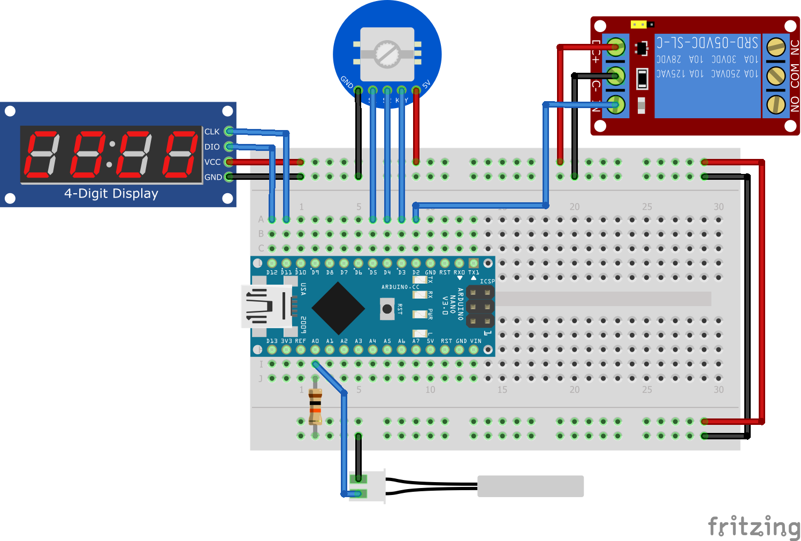

# Ardustat

Термостат на Arduino Nano + NTC с 4-разрядным 7-сегментным дисплеем.

Схема:



Схема в KiCad [здесь](./kicad).

Схема KiCad в PDF [здесь](./kicad/renders/scheme.pdf).

ВНИМАНИЕ!!! Код создавался в онлайн-симуляторе [Wokwi](https://wokwi.com/) и не проверялся в реальности.

Настройки сохраняются в EEPROM. Беспокоиться не стоит, используется библиотека EEManager с удобной логикой.

Занятые ресурсы МК по мнению PlatformIO:

```
RAM:   [=         ]  10.0% (used 205 bytes from 2048 bytes)
Flash: [==        ]  24.7% (used 7586 bytes from 30720 bytes)
```

## Зависимости - в [platformio.ini](./platformio.ini)

## Электронные компоненты

- Arduino Nano
- Реле на 5V на ток `мощность / напряжение` + запас. Например ТЭН на 2КВт с напряжением 220V потребляет ток ~9A - лучше взять реле с запасом, например на 16 ампер. На али лично я не видел модулей реле выше 10 ампер, поэтому можно взять твердотельное. Но оно существенно дороже обычного - 500 рублей против 60. Зато оно не боится частых переключений, не нужна никакая обвязка, контакты не могут износиться (их там нет -_-). Минус твердотельного реле - оно греется, поэтому нужно брать с запасом по току и/или крепить на радиатор
- Модуль энкодера с кнопкой с обвязкой против дребезга ([инфо](https://github.com/GyverLibs/EncButton#%D1%80%D0%B5%D0%BA%D0%BE%D0%BC%D0%B5%D0%BD%D0%B4%D0%B0%D1%86%D0%B8%D0%B8)). На али у него круглая синяя плата
- Термистор
- Резистор, равный сопротивлению термистора
- Дисплей TM1637

## Руководство пользователя

В формате .Docx - в нем удобнее делать дизайн для печати.

Приложено к Github релизу и [лежит тут](./USER_MANUAL.docx)

## А как прошить, а как собрать

- [Уроки Arduino](https://alexgyver.ru/arduino-first/)
- [Оф гайд Platformio CLI](https://docs.platformio.org/en/latest/core/quickstart.html)
- [Оф гайд Platformio IDE (VSCode)](https://docs.platformio.org/en/latest/integration/ide/vscode.html)

## История версий - в [CHANGELOG.md](./CHANGELOG.md)
